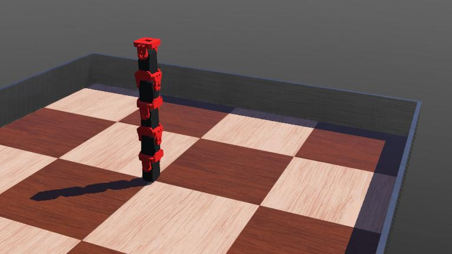

# SnakeSim



SnakeSim provides a ROS2 and Webots simulation environment of a simple redundant robotic arm performing cartesian motion in a 3D workspace.

## Prerequisites

Ensure you have the following installed on your system (Ubuntu 22.04):

- ROS2 Humble Hawksbill
- Webots

## Installation Steps

### 1. Install ROS2 on Ubuntu 22.04

Follow the official ROS2 installation guide for Debian packages [here](https://docs.ros.org/en/humble/Installation/Ubuntu-Install-Debians.html).

### 2. Create a ROS2 Workspace and clone the package

```sh
mkdir -p ~/ros2_ws/src
cd ~/ros2_ws/src
git clone https://github.com/hugotallys/snakesim.git
```

### 3. Build the Workspace and source the setup file

```sh
cd ~/ros2_ws
colcon build --symlink-install
source install/local_setup.sh
```

### 4. Install Webots

Download and install Webots from the official [Webots website](https://cyberbotics.com/doc/guide/installing-webots). You should also install the `webots_ros2_driver`:

```sh
sudo apt-get install ros-humble-webots-ros2
```

More information on how to setup a Webots simulation with ROS can be found in the [official ROS2 documenation](https://docs.ros.org/en/humble/Tutorials/Advanced/Simulators/Webots/Installation-Ubuntu.html)

### 5. Setup Python Environment

Create a virtual environment and install the necessary Python packages:

```sh
python3 -m venv ~/ros2_ws/venv
source ~/ros2_ws/venv/bin/activate
```

You must ensure Colcon ignores the python venv

```sh
touch ~/ros2_ws/venv/COLCON_IGNORE
```

Install the python packages with pip:

```sh
pip install -r ~/ros2_ws/src/snakesim/requirements.txt
```

## Running the Simulation

Open a terminal source the workspace. We first instatiate the simulator with the action server node:

```sh
cd ~/ros2_ws
source install/local_setup.zsh
ros2 launch snakesim snake_launch.py
```

To start the trajectory execution start the action client in another tab:

```sh
cd ~/ros2_ws
source install/local_setup.zsh
ros2 run snakesim snake_trajectory_client --ros-args -p metric_name:=<metric_name> -p experiment_type:=<experiment_type>
```

Where `<metric_name>` is the name of the metric to be optimized and `<experiment_type>` is the type of experiment to be executed. The values
that can be chosen are:

- `metric_name`: `joint_distance`, `manipulability`.
- `experiment_type`: `null_space`, `trajectory`.
